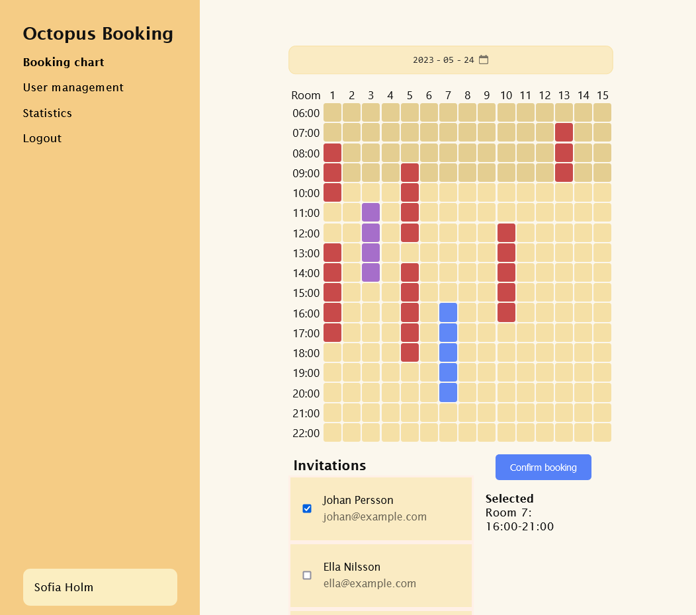

# Octopus Booking

Octopus Booking is a project developed for a school assignment during the first year of the Digital Business Development program. It is designed to provide a booking management system to the fictional company Big Squid AB. This readme file will guide you on how to get started with running the project on your own machine.



## Getting Started

_A tutorial for running Octopus Booking locally._

### Prerequisites

Before you can follow the guide, ensure that you have XAMPP installed or a similar local web server environment.

### Instructions

To run Octopus Booking on your local machine, follow these steps:

1. Clone the Octopus Booking repository to your local machine.

    ```shell
    cd /xampp/htdocs # If not another path
    git clone https://github.com/davlin0222/octopus-booking.git
    ```

2. Start XAMPP and ensure that the Apache and MySQL services are running.

3. Open a web browser and navigate to `http://localhost/phpmyadmin/` to access the phpMyAdmin interface.

4. Create a new MySQL database for Octopus Booking.

```sql
CREATE DATABASE octopus_booking;
USE octopus_booking;
```

5. Run the SQL dump stored in the database-setup.sql file.

6. Create a php.ini file with the following. Make sure to add your appropriate credentials. Email might not work if your provider doesn't allow emails being sent in this manner.

```
[database]
hostname = "localhost"
username = "root"
password = ""
database = "octopus_booking"

[email]
host = "example.example.com"
username = "name@example.com"
password = ""
```

7. Open a web browser and navigate to `http://localhost/octopus-booking/` to access the Octopus Booking application. If not another path.

## License

This project is licensed under the terms of the [MIT License](LICENSE).
